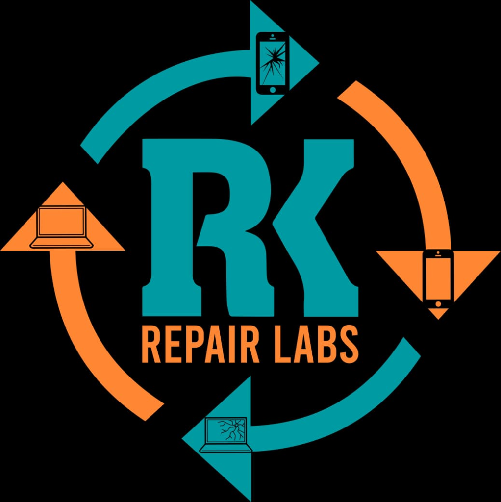

<div align="center">
  
  <h1>RK Repair Labs — SaaS Management System</h1>
  <p><strong>A Next-Generation, AI-Powered Mobile & Electronics Repair Shop Management Platform</strong></p>
</div>

---

## 📖 Overview

**RK Repair Labs Management System** is a complete, production-ready SaaS application designed for mobile repair shops, laptop repair centers, and electronics service businesses. 

It provides a seamless dual-experience architecture:
1. **Public Marketing Website**: A highly optimized, modern lead-generation frontend for customers to view services, learn about the brand, contact the shop, and track their repair status in real-time.
2. **Internal SaaS Dashboard**: A secure, comprehensive business management backend for owners, technicians, and staff to manage day-to-day operations, billing, inventory, and analytics.

---

## ✨ Key Features

### 🏢 Public Website (Customer-Facing)
- **Modern Landing Pages**: Home, Services, About, and Contact pages built with responsive Tailwind CSS and Framer Motion micro-animations.
- **Live Repair Tracking**: Customers can enter their unique `Ticket ID` to view live repair progress and technician notes.
- **WhatsApp Quick Chat**: Integrated WhatsApp redirection for instant customer support.
- **Google Maps Integration**: Interactive location maps for easy physical store navigation.

### 🔐 Internal Dashboard (Business-Facing)
- **Comprehensive Repair Workflow**: Track repairs through multiple stages (Received ➔ Diagnosed ➔ Waiting for Parts ➔ In Progress ➔ Completed ➔ Delivered).
- **Customer Management**: Maintain detailed records, device histories, and contact information.
- **Inventory & Parts Management**: Track stock levels, accessories, purchase prices, and receive low-stock alerts.
- **Advanced Billing & Invoicing**: Generate professional, itemized GST invoices in PDF format with integrated QR codes.
- **Profit & Loss Analytics**: Interactive charts and data tables to track daily, weekly, and monthly revenue.
- **Role-Based Access Control (RBAC)**: Secure access for Admins, Managers, and Technicians.
- **WhatsApp Automation**: Send invoices, repair updates, and delivery reminders directly to customers via WhatsApp API.

---

## 🛠️ Technology Stack

This project is built using a modern, scalable JavaScript/TypeScript stack:

- **Framework**: [React 18](https://react.dev/) + [Vite](https://vitejs.dev/) + [TanStack Router](https://tanstack.com/router)
- **Styling**: [Tailwind CSS](https://tailwindcss.com/) + [Framer Motion](https://www.framer.com/motion/) + `shadcn/ui`
- **State & Data Fetching**: [TanStack Query](https://tanstack.com/query) (React Query)
- **Icons**: [Lucide React](https://lucide.dev/)
- **Charts**: [Recharts](https://recharts.org/)
- **PDF Generation**: `@react-pdf/renderer`
- **Backend/Database**: Decoupled Repository Pattern (currently using In-Memory Mock Store, ready for PostgreSQL/MongoDB/Firebase)
- **Deployment**: Nitro Bundler / Vercel / Node Server

---

## 🚀 Getting Started

### Prerequisites
Make sure you have [Node.js](https://nodejs.org/) (v18+) and `npm` installed.

### Installation

1. **Clone the repository**
   ```sh
   git clone https://github.com/srujan66619/rk-repair-labs.git
   cd rk-repair-labs
   ```

2. **Install dependencies**
   ```sh
   npm install
   ```

3. **Set up Environment Variables**
   Create a `.env` file in the root directory and configure your Supabase/Backend credentials as required.

4. **Start the Development Server**
   ```sh
   npm run dev
   ```
   The application will be available at `http://localhost:5173`.

### Build for Production
To generate a production-ready bundle:
```sh
npm run build
```

---

## 📂 Project Structure

```text
src/
├── components/       # Reusable UI components (shadcn, layout wrappers)
├── hooks/            # Custom React hooks
├── lib/              # Utilities, API functions, PDF generators, formats
├── routes/           # TanStack Router page components
│   ├── _public/      # Marketing website pages (Home, About, Services, Track)
│   └── _authenticated/ # SaaS Dashboard pages (Billing, Inventory, Repairs)
├── assets/           # Static files and assets
└── router.tsx        # Application routing configuration
```

---


<div align="center">
  <i>Designed & Developed for RK Repair Labs</i>
</div>
